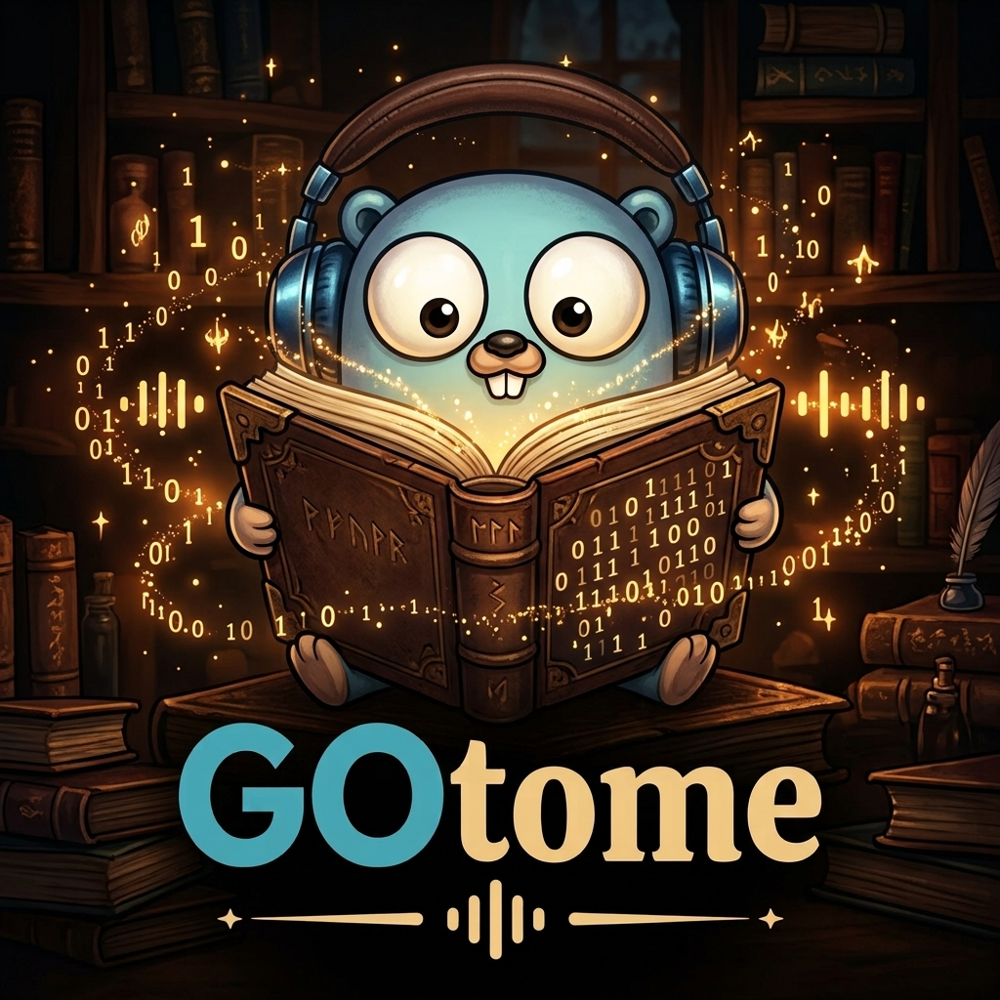

<p align="center">
  
</p>

# GOtome

Self-hosted library manager for ebooks, PDFs and audiobooks.

**Status: early development.** Nothing is usable yet. The plan is tracked as
[issues](https://github.com/praetorianer777/GoTome/issues) grouped into
[milestones](https://github.com/praetorianer777/GoTome/milestones).

## Planned

- Exact and near-duplicate detection (file hashes, ISBN, title and author, text
  overlap via MinHash/LSH) with a merge and replace dashboard
- Metadata from OpenLibrary, Google Books, Hardcover and CrossRef; editing, EPUB
  write-back, bulk operations and background matching
- Filtering, typo-tolerant and full-text search inside book text
- Per-user reading state, synced progress, statistics
- In-browser EPUB/PDF reader and audiobook player
- Smart shelves defined by rules
- Release tracking for authors and series with notifications (Discord, Telegram,
  ntfy, Gotify, in-app)
- Content-based "similar books"
- Multi-user with roles (Admin, Editor, Reader), private and shared libraries,
  optional OIDC

## Stack

Go backend, React and Tailwind CSS frontend, PostgreSQL. A deployment is two
containers: the app and the database.

## Running it

There is no release yet, so the image is built from the checkout:

```bash
git clone https://github.com/praetorianer777/GoTome.git && cd GoTome
POSTGRES_PASSWORD=choose-one docker compose -f deploy/docker-compose.yml up -d --build
```

Then open <http://localhost:8080> and create the first account. The database
password is fixed once the volume exists, so choose it before the first start.
Once a release is published, the same file pulls the image instead of building it.

## Development

Every change belongs to an issue and lives on a branch `<type>/<issue>-<slug>`;
see [CLAUDE.md](CLAUDE.md). `./run-tests.sh` is the gate that must pass before a push.

## Licence

[AGPL-3.0](LICENSE)

The artwork is based on the Go gopher, designed by
[Renée French](https://go.dev/blog/gopher) and licensed under
[CC BY 4.0](https://creativecommons.org/licenses/by/4.0/).
